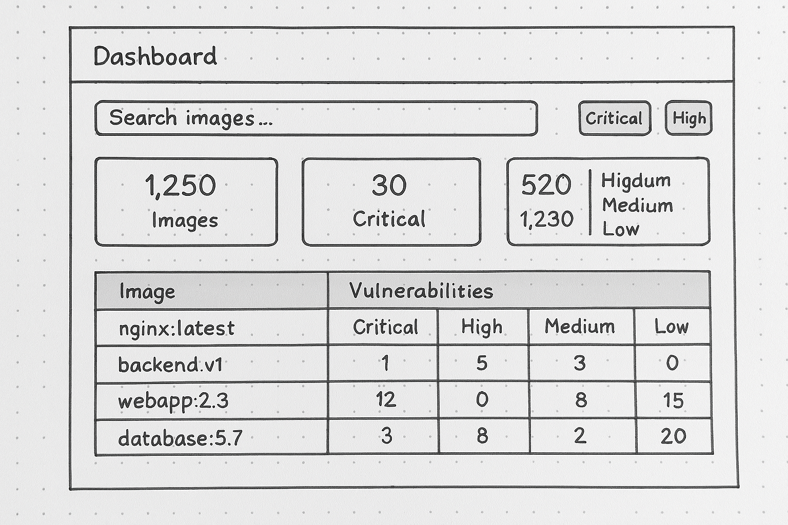
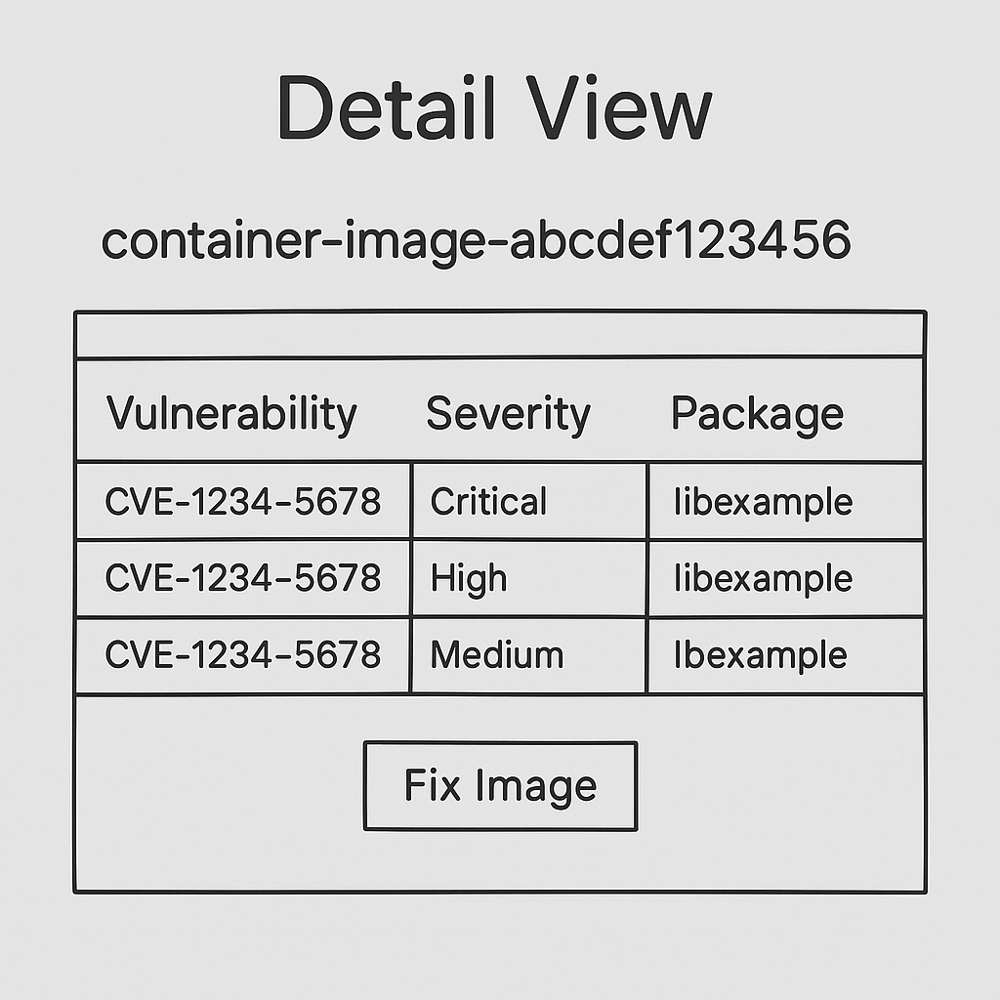

# 🧱 Problem 1: Product Design — Container Image Vulnerability Scanner

## 📝 Objective
Design a product that allows users to scan container images, identify vulnerabilities, and take action — especially focusing on critical and high vulnerabilities.

---

## 🔍 Problem Overview
Container images often carry known vulnerabilities due to bundled dependencies. Users need a system to:
- Identify which images are vulnerable.
- Understand severity levels (Critical, High, Medium, Low).
- Prioritize and remediate issues efficiently.
- Handle scale — with potentially thousands of images.

---

## 👤 User Personas
- **DevSecOps Engineer:** Needs quick insights and actionable items.
- **Security Analyst:** Requires reports and breakdowns for compliance.
- **Developer:** Seeks clarity on vulnerabilities in their own images.

---

## 🎯 Product Goals
- Dashboard showing vulnerability stats across container images.
- Severity-based filtering and sorting.
- Detail view with CVE-level insights and fix suggestions.

---

## 📚 Product Requirements Document (PRD)
📄 [Click here to view the full PRD](./PRD_Container_Scanner.md)

---

## 🖼️ Low-Fidelity Wireframes

### 🧭 Dashboard View
Shows all scanned images and summary stats with clickable rows.

---

### 🔍 Detail View
Presents full CVE breakdown and metadata for the selected image.

---

## 🛠 Suggested Development Action Items
- Integrate vulnerability scanner (e.g., Trivy, Clair).
- Build REST API for scan results.
- Implement UI dashboard, filters, and detail modals.
- Add user authentication and access control.

---

## ✅ Deliverables
- 📄 PRD (requirements, personas, features, wireframe description)
- 🖼 Wireframes (low-fidelity)
- 📌 Dev action items for MVP scope
